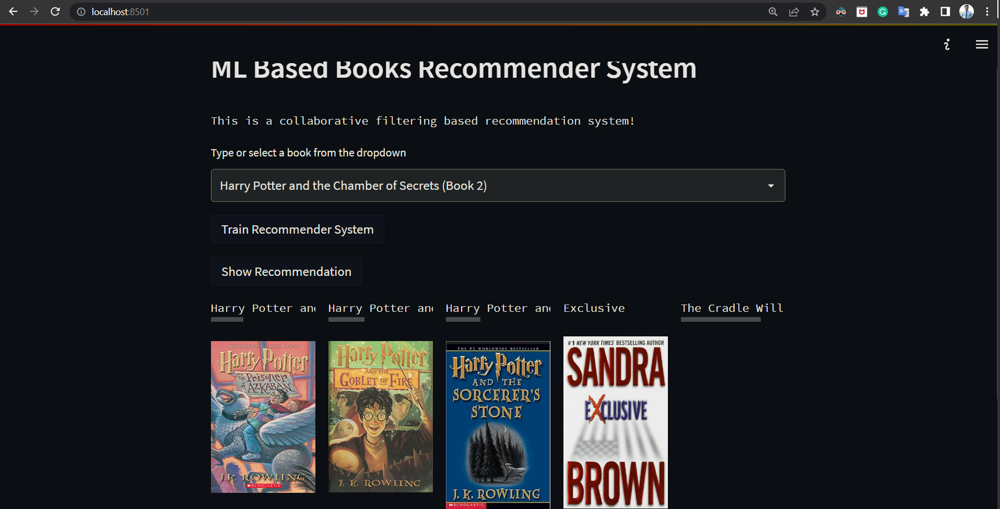
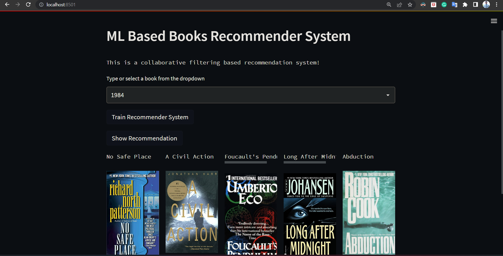

# Project: Recommender System for books

A recommendation system's primary function is to look for content that may be of interest to a particular person. Furthermore, it takes into account a variety of factors in order to generate personalized lists of useful and interesting content for each user/individual. Recommendation systems are AI-based algorithms that sift through all possible options and generate a personalised list of items that are interesting and relevant to an individual. These outcomes are determined by their profile, search/browsing history, what other people with similar characteristics/demographics are watching, and how likely you are to watch those movies. With the data available, this is accomplished through predictive modelling and heuristics.

# Types of Recommendation System :

### 1 ) Content Based :

Content-Based recommendation systems, as seen on platforms like YouTube and Twitter, make suggestions based on the specific attributes of items, such as genres, content creators, or singers. By converting these attributes into numerical vectors or embeddings, the system aligns items with user preferences. However, a limitation is that they can become overly specialized, often recommending only what the user has previously shown interest in and potentially missing out on diverse content.


### 2 ) Collaborative Based :
		
Collaborative-Based recommendation systems, such as those used in E-commerce, Netflix, primarily operate on user-item interactions like ratings or comments. These systems identify and recommend items by grouping users with similar tastes or by assessing shared preferences among them. For instance, if two users both enjoy a particular book, and one of them likes another book, the system might suggest that second book to the first user. However, these systems can be computationally intensive due to the need for large user-item matrices. They also tend to favor popular items, often sidelining newer or less-known items in their recommendations.

### 3 ) Hybrid Based :
	
Hybrid-Based recommendation systems integrate the strengths of both content-based and collaborative filtering approaches, aiming to mitigate the shortcomings of using either method in isolation. These contemporary systems often employ techniques like word2vec and embeddings to optimize recommendations, ensuring a more comprehensive and accurate user experience.

# About this repo:

This is a streamlit app for collaborative filtering based books recommendation system that can recommend various kinds of similar books based on an user's interest.


# Demo:






# How to run?
### STEPS:

Clone the repository

```bash
https://github.com/pranavtondgaonkar/REC-SYS-BOOK
```
### STEP 01- Create a conda environment after opening the repository

```bash
conda create -n books python=3.7.10 -y
```

```bash
conda activate books
```


### STEP 02- install the requirements
```bash
pip install -r requirements.txt
```


Now run,
```bash
streamlit run app.py
```

```bash
Note: Before clicking on show recommendations first of all click on Train Recommender System for generating models
```

# How to run in Docker?

#### Build a Docker image
The docker build command builds an image from a Dockerfile . Run the following command from the app/ directory on your server to build the image:


```bash
docker build -t streamlit .
```

The -t flag is used to tag the image. Here, we have tagged the image streamlit. If you run:

```bash
docker images
```
You should see a streamlit image under the REPOSITORY column. For example:

```bash
REPOSITORY   TAG       IMAGE ID       CREATED              SIZE
streamlit    latest    70b0759a094d   About a minute ago   1.02GB
```

#### Run the Docker container
Now that you have built the image, you can run the container by executing:

```bash
docker run -p 8501:8501 streamlit
```

The -p flag publishes the container’s port 8501 to your server’s 8501 port.

If all went well, you should see an output similar to the following:

```bash
$ docker run -p 8501:8501 streamlit

  You can now view your Streamlit app in your browser.

  URL: http://127.0.0.1:8501/
```

To view your app, users can browse to http://0.0.0.0:8501 or http://127.0.0.1:8501/
